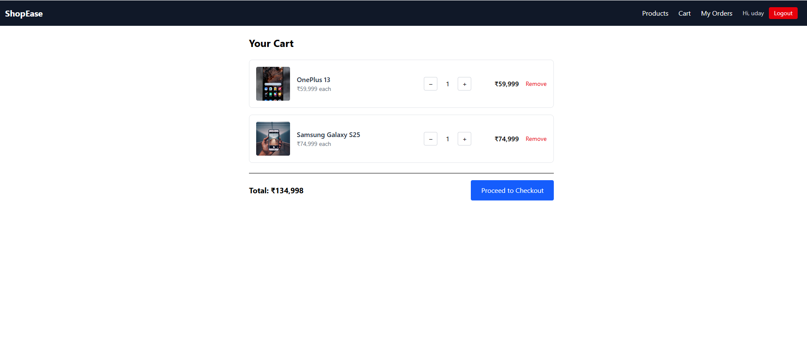
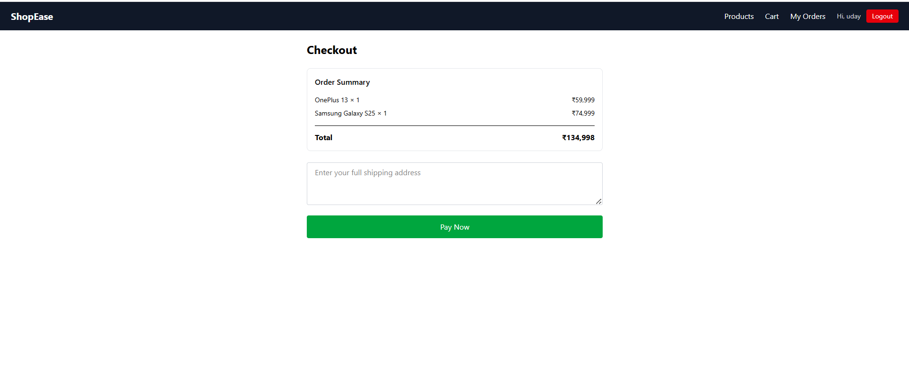
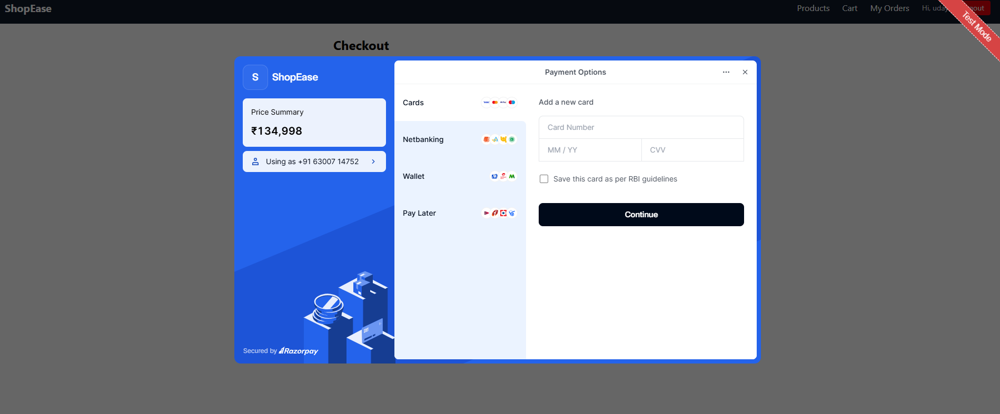
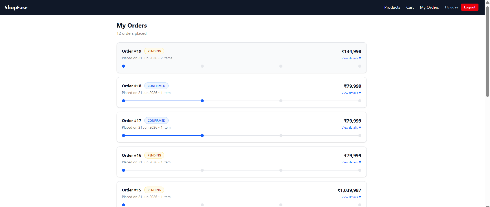

# ShopEase — Full-Stack E-Commerce Web Application

A complete e-commerce platform built with Spring Boot, React, and MySQL — featuring JWT authentication, role-based access control, Razorpay payment integration, concurrency-safe order processing, and a full admin dashboard.

🔗 **Live Demo:** _coming soon_
📦 **Backend Repo:** [github.com/siripiudaykumarreddy-jpg](https://github.com/siripiudaykumarreddy-jpg)

---

## 📸 Screenshots

### Category Browsing


### Product Catalog


### Shopping Cart



### Checkout



### Razorpay Payment



### Order History



---

## ✨ Features

### Customer Features

* Browse products by category
* Search and filter products
* Add products to cart
* Persistent cart storage
* Secure checkout using Razorpay
* Order history with status tracking
* Product reviews for verified buyers
* JWT-based login and registration

### Admin Features

* Product management (Create, Update, Delete)
* View all customer orders
* Update order status
* Role-based access control using Spring Security

---

## 🚀 Backend Engineering Highlights

* JWT Authentication with custom `AuthenticationEntryPoint` and `AccessDeniedHandler` for clean 401/403 responses
* Optimistic locking (`@Version`) + `@Retryable` with exponential backoff to safely handle concurrent stock deductions — each retry runs in a fresh `Propagation.REQUIRES_NEW` transaction to avoid stale reads
* Pessimistic locking on payment verification to guarantee idempotency — concurrent verification calls for the same payment are safely deduplicated
* Razorpay signature verification using HMAC SHA-256 to prevent payment spoofing
* Global exception handling (`@RestControllerAdvice`) returning structured, consistent JSON error responses
* JPA Specifications for dynamic product search (keyword + category + price range + sorting + pagination)

---

## 🏗️ System Architecture

```text
┌──────────────────────┐
│      React App       │
│   (Vite + Axios)     │
└──────────┬───────────┘
           │ HTTP/JSON
           ▼
┌──────────────────────┐
│   Spring Security    │
│ JWT Authentication   │
└──────────┬───────────┘
           │
           ▼
┌──────────────────────┐
│    REST Controllers  │
└──────────┬───────────┘
           │
           ▼
┌──────────────────────┐
│   Service Layer      │
│ Business Logic       │
└──────────┬───────────┘
           │
           ▼
┌──────────────────────┐
│ Spring Data JPA      │
│    Repositories      │
└──────────┬───────────┘
           │
           ▼
┌──────────────────────┐
│      MySQL DB        │
└──────────────────────┘

External Integration:
      │
      ▼
┌──────────────────────┐
│ Razorpay Payment API │
└──────────────────────┘
```

---

## 🔄 Application Workflow

### Customer Workflow

```text
User Registration/Login
          │
          ▼
     Browse Products
          │
          ▼
      Add to Cart
          │
          ▼
        Checkout
          │
          ▼
 Create Razorpay Order
          │
          ▼
    Complete Payment
          │
          ▼
 Verify Payment Signature
          │
          ▼
       Place Order
          │
          ▼
      Update Stock
          │
          ▼
    View Order History
```

### Admin Workflow

```text
      Admin Login
           │
           ▼
    Manage Products
           │
           ▼
      View Orders
           │
           ▼
   Update Order Status
           │
           ▼
        Pending
           │
           ▼
       Confirmed
           │
           ▼
        Shipped
           │
           ▼
       Delivered
```

---

## 🛠️ Tech Stack

### Backend

* Java 17
* Spring Boot 3.2.5
* Spring Security
* Spring Data JPA
* Hibernate
* MySQL
* JWT (jjwt)
* Spring Retry
* Razorpay Java SDK

### Frontend

* React 18
* Vite
* React Router
* Axios
* Tailwind CSS v4

### Database

* MySQL

---

## 📋 Prerequisites

* Java 17+
* Node.js 18+
* MySQL 8+
* Razorpay Test Account

---

## 🚀 Setup Instructions

### 1. Clone Repository

```bash
git clone <repository-url>
cd <repository-folder>
```

### 2. Create Database

```sql
CREATE DATABASE ecommerce_db;
```

### 3. Backend Setup

```bash
cd ecommerce-backend
```

Configure the following environment variables:

| Variable            | Description          |
| -------------------- | -------------------- |
| DB_PASSWORD          | MySQL Password        |
| RAZORPAY_KEY_ID       | Razorpay Key ID       |
| RAZORPAY_KEY_SECRET   | Razorpay Key Secret   |

Run the backend:

```bash
mvn spring-boot:run
```

Backend runs at:

```text
http://localhost:8080
```

### 4. Frontend Setup

```bash
cd ecommerce-frontend
npm install
npm run dev
```

Frontend runs at:

```text
http://localhost:5173
```

---

## 👨‍💼 Admin Setup

Register a normal user and promote the account to ADMIN:

```sql
UPDATE users
SET role = 'ADMIN'
WHERE email = 'your-email@example.com';
```

---

## 📂 Project Structure

```text
ecommerce-backend/
├── controller/
├── service/
├── repository/
├── entity/
├── dto/
├── security/
└── exception/

ecommerce-frontend/
├── pages/
├── components/
├── context/
└── api/
```

---

## 🔑 Key API Endpoints

| Method | Endpoint                       | Access        |
| ------ | -------------------------------- | ------------- |
| POST   | /api/auth/register                | Public        |
| POST   | /api/auth/login                    | Public        |
| GET    | /api/categories                    | Public        |
| GET    | /api/products                      | Public        |
| POST   | /api/products                      | Admin         |
| PUT    | /api/products/{id}                 | Admin         |
| DELETE | /api/products/{id}                 | Admin         |
| POST   | /api/orders                        | Authenticated |
| GET    | /api/orders/my-orders              | Authenticated |
| GET    | /api/orders                        | Admin         |
| PUT    | /api/orders/{id}/status            | Admin         |
| POST   | /api/payments/create-order         | Authenticated |
| POST   | /api/payments/verify               | Authenticated |
| POST   | /api/reviews                       | Authenticated |
| GET    | /api/reviews/product/{productId}   | Public        |

---

## 📄 License

This project was built for educational and portfolio purposes.

---

## 👤 Author

### Siripi Uday Kumar Reddy

Full-Stack Developer

[](https://github.com/siripiudaykumarreddy-jpg)
[](https://www.linkedin.com/in/udayreddy83483/)

Built using Spring Boot, React, MySQL, JWT Authentication, Razorpay Integration, Spring Security, and modern backend engineering practices.
